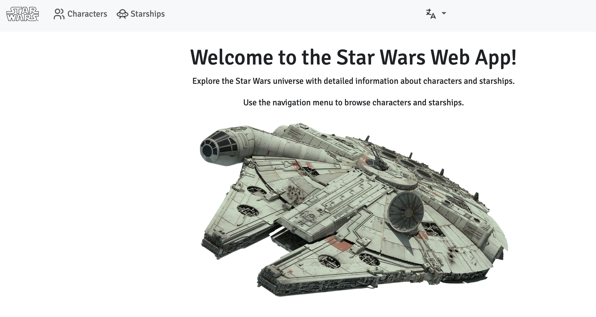
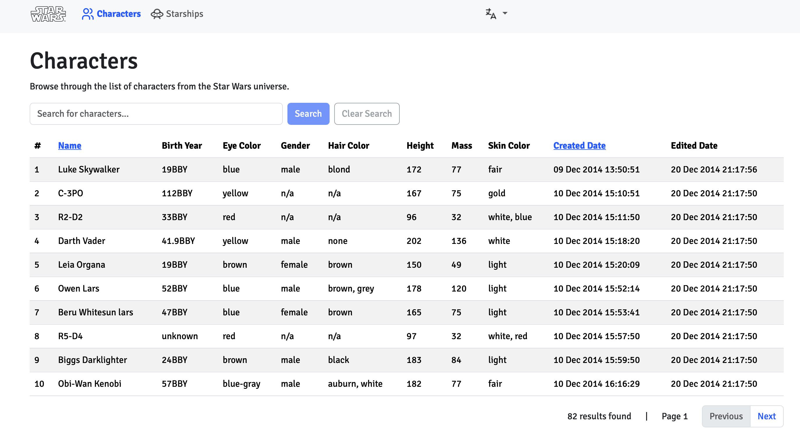
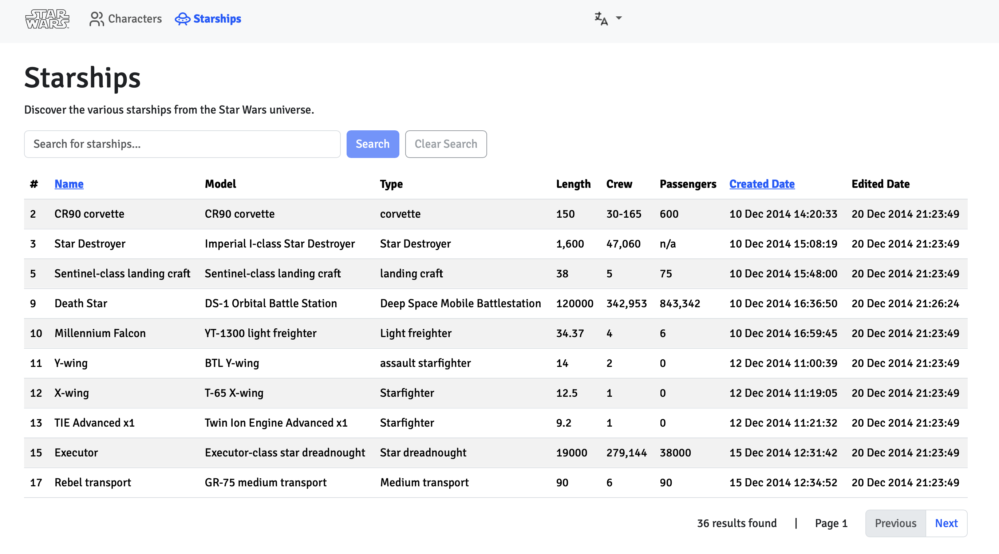
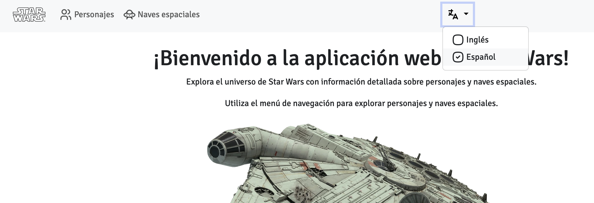

# Star Wars Web Application

The Star Wars Web Application is a simple web app that displays characters and starships from the Star Wars universe
using the SWAPI (Star Wars API). It is built with Spring Boot and Thymeleaf, and it can be run as a standalone
application or in a Docker container.

## Tool and framework versions used

- **Java**: 21
- **Gradle**: 8.14.3
- **Spring Boot**: 3.5.4
- **Thymeleaf**: 3.1.3
- **Bootstrap**: 5.3.7

## How to run this project

First, clone the repository:

```bash
git clone https://github.com/pedrazamiguez/star-wars-webapp.git
```

Then, navigate to the project directory:

```bash
cd star-wars-webapp
```

### Running the application locally

Make sure you have Java 21 installed.

> **Important**: Before continuing, you may need to import the certificate for the API URL into your JDK's `cacerts`
> file.
> See the section at the end for instructions.

Issue the following command:

```bash
./gradlew bootRun
```

The application will start on port 8080. You can access it by navigating
to [http://localhost:8080](http://localhost:8080) in your web browser.

Optionally, you can generate a JAR file to run the application:

```bash
./gradlew bootJar
```

Then run the JAR file:

```bash
java -jar star-wars-webapp-boot/build/libs/star-wars-webapp-boot-0.0.1-SNAPSHOT.jar
```

### Running the application as a Docker container

First of all, make sure you have Docker installed on your machine and the service is running.

Since a `Dockerfile` is provided, you can build the Docker image as follows:

```bash
docker build -t pedrazamiguez/star-wars-webapp .
```

Then use the generated image to run the application in a Docker container:

```bash
docker run --name star_wars_webapp -p 6969:6969 pedrazamiguez/star-wars-webapp
```

The application will be accessible at [http://localhost:6969](http://localhost:6969).

## App features

The application provides the following features:

- **Landing page**: A simple landing page with a welcome message and top navigation to the main features of the
  application.



- **List characters**: Displays a paginated list of characters from the Star Wars universe. You can search for
  characters
  by name and navigate through pages. Also, sorting by name or created date in both ascending and descending order is
  supported.



- **List starships**: Displays a paginated list of starships from the Star Wars universe. You can search for starships
  by name or model and navigate through pages. Also, sorting by name or created date in both ascending and descending
  order is supported.



- **Language selection**: The application supports multiple languages (English and Spanish) and allows users to switch
  between them.



- **Error page**: A custom error page is displayed when an error occurs, providing a user-friendly message and a link to
  return to the home page.


## Project structure

This is a multi-module Gradle project which follows a hexagonal architecture approach. The main modules are:

- **star-wars-webapp-boot**: The main module that contains the Spring Boot application and integration tests.

- **star-wars-webapp-domain**: Contains the domain model and business logic. No dependencies on external libraries.

- **star-wars-webapp-application**: Use cases and services implementations.

- **star-wars-webapp-infrastructure**: Adapters for external systems. It's actually a parent module that includes the
  following submodules:

    - **star-wars-webapp-api-client**: Implementation of the SWAPI client.

- **star-wars-webapp-presentation**: Contains the web layer, including controllers and Thymeleaf templates.

## About the SWAPI

The SWAPI (Star Wars API) is a RESTful API that provides access to data from the Star Wars universe. It includes
information about characters, starships, planets, species, and vehicles, although this application focuses on characters
and starships endpoints at the minute.

The API is publicly available and can be accessed at [https://swapi.dev/](https://swapi.dev/).

> **Note**:
>
> The first recommended API to use for this project was the [SWAPI - CO](https://swapi.co/), but it seems to have
> changed domain.
>
> Also, [SWAPI - TECH](https://swapi.tech/), but apparently resources are returned as URLs instead of JSON
> objects, so it was not really convenient for this project.

Finally, the API allows pagination and search, but not sorting or defining the number of results per page.

## Some notes about the implementation

Since the API is limited in terms of sorting and pagination, the application fetches asynchronously all characters and
starships on startup and caches them using Caffeine, improving significantly the performance of the application. In the
event of failure to fetch the data, the application will still work and try again on the first request to the API.

If this behavior is not desired, you can disable it by changing the following setting to `false` in the
`application.yml` file:

```yaml
swapi:
  base-url: https://swapi.dev/api
  default-page-size: 10
  load-data-on-startup: false      # <-- Change this to false in order to disable loading data on startup
```

## Importing the certificate for the API URL into your JDK

At the time of developing, I was getting the following error when trying to access the API URL:

```
2025-08-16T10:54:02.448+02:00 ERROR 83406 --- [ Test worker] e.p.s.a.service.PersonClientServiceImpl : Failed to fetch characters for page 1: I/O error on GET request for "https://swapi.dev/api/people/": PKIX path validation failed: java.security.cert.CertPathValidatorException: validity check failed

org.springframework.web.client.ResourceAccessException: I/O error on GET request for "https://swapi.dev/api/people/": PKIX path validation failed: java.security.cert.CertPathValidatorException: validity check failed
```

To solve the issue, I had to add the certificate to my JDK's `cacerts` file:

1. **Get the certificate**:

```
openssl s_client -connect swapi.dev:443 -servername swapi.dev < /dev/null | openssl x509 -outform PEM > swapi.pem
```

2. **Add it to the JDK's cacerts file**:

```
sudo keytool -importcert -file swapi.pem -alias swapi -keystore $JAVA_HOME/lib/security/cacerts -storepass changeit
```
